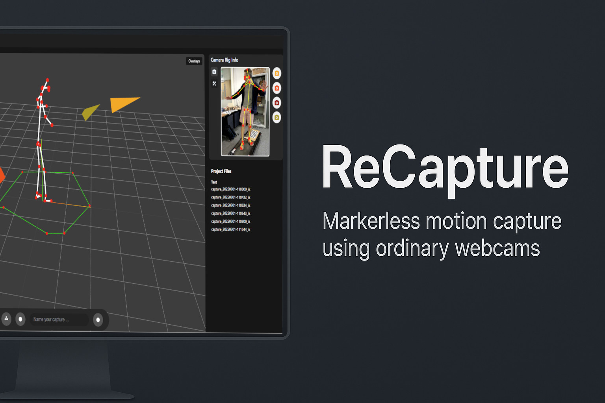

# IRIS Starter Application


ReCapture is a desktop application that delivers real-time gait analysis using consumer grade webcams and PC.

## 🚀 Quick Start

Get your development environment running in minutes:

Download and install [IRIS](https://iris.cs.bath.ac.uk/).

```powershell
# Install dependencies
npm install

# Launch the developer environment
npm run dev

# Build for production
npm run build
```

After running the application, you will need to enter a FREE license key for IRIS available from [iris.cs.bath.ac.uk](https://iris.cs.bath.ac.uk/).
Instruction for app usage can be found in the help menu of the application.

## 🆘 Resources & Support 
Please request access from mrt64@bath.ac.uk if you can't see these repositories
- [Documentation](https://ReCapture.cs.bath.ac.uk)

Built with ❤️ by the **Bath Impact Lab**.


